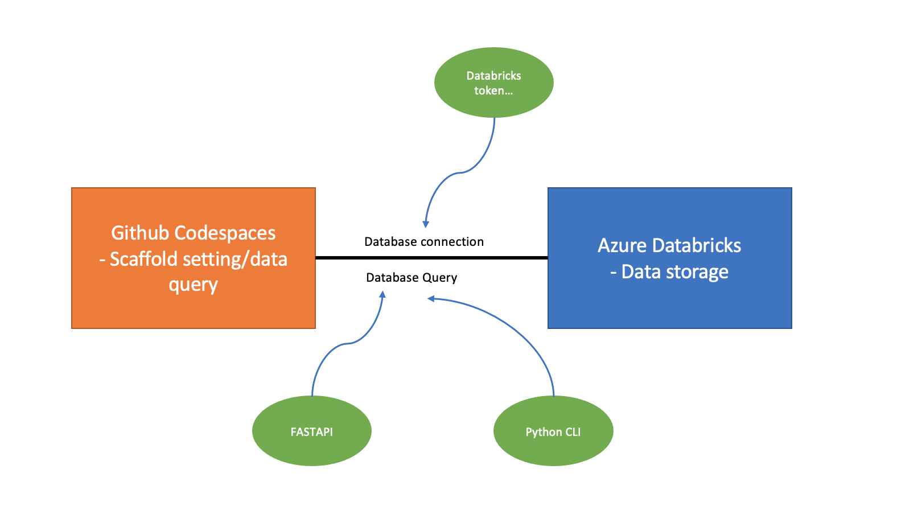

# Bash Command Tool


This is the repo of IDS706 project 2. This project is about query a dataset from kaggle in bash file. The dataset is now store in Databricks.

## Architectural Diagram


## Installation
Make sure you can access Databricks in codespaces
```bash
sh command.sh
```

## Tool Used
    Azure DataBricks - data storage <br>
    Python CLI - Faciliate command line argument <br>
    Pylint - check code quality <br>
    Python format - format code <br>
    FASTAPI - send http request to query database <br>
