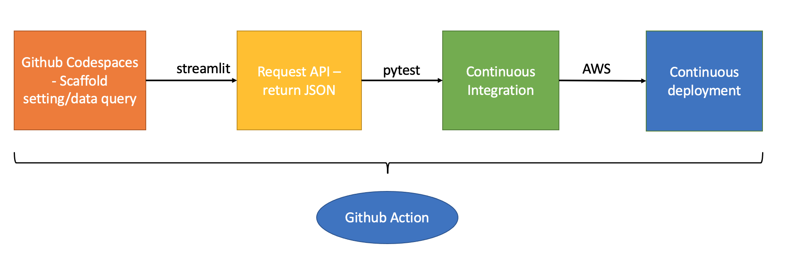

# JSON query with CICD pipeline


This is the repo of IDS706 project 4. This project is about requesting a API to a remote server, receive a JSON response from the remote server, then display the JSON response in the website.

## Architectural Diagram


## Workflow
Users can enter the specific query they want to request or use the default API provided by the website. For each commit, CICI pipeline will be carried out as indicated in main.yml for fast delivery. For continuous integration, pytest is used to check the code correctness. Then the project will be deployed into AWS automatically.

## How to Run
Please install all the dependencies listed in requirements.txt

```bash
streamlit run app.py --server.enableCORS false --server.enableXsrfProtection false
```

## Tool Used
    <br>Pylint - check code quality </br>
    <br>Python format - format code <br>
    <br>Pytest - test code </br>
    <br>Streamlit - let user enter the specific API they want to query </br>
    <br> AWS ecr, ecs - automatic deployment </br>
