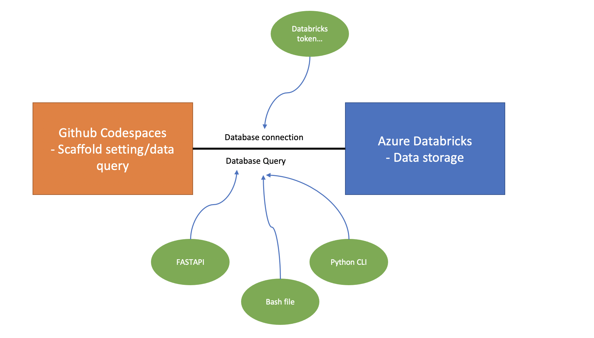

# SQL query website - Netflix Query Hub


This is the repo of IDS706 project 3. This project is about SQL query a dataset from kaggle and then plot the line chart using streamlit. The dataset is now store in Databricks.

## Architectural Diagram


## Workflow
Two main functions are supported here : first insert into database, second sql query result visualization

## How to Run
Make sure you can access Databricks in codespaces
```bash
streamlit run app.py --server.enableCORS false --server.enableXsrfProtection false
```

## Tool Used
    Azure DataBricks - data storage <br>
    Python CLI - Faciliate command line argument <br>
    Pylint - check code quality <br>
    Python format - format code <br>
    FASTAPI - send http request to query database <br>
    Streamlit - insert sql query into database and compare the amounts of two different categories using line chard <br>
